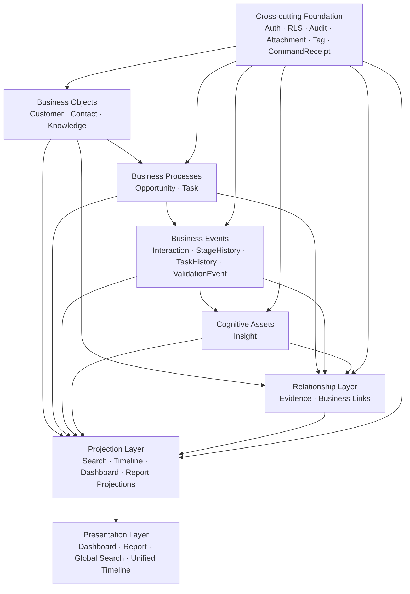
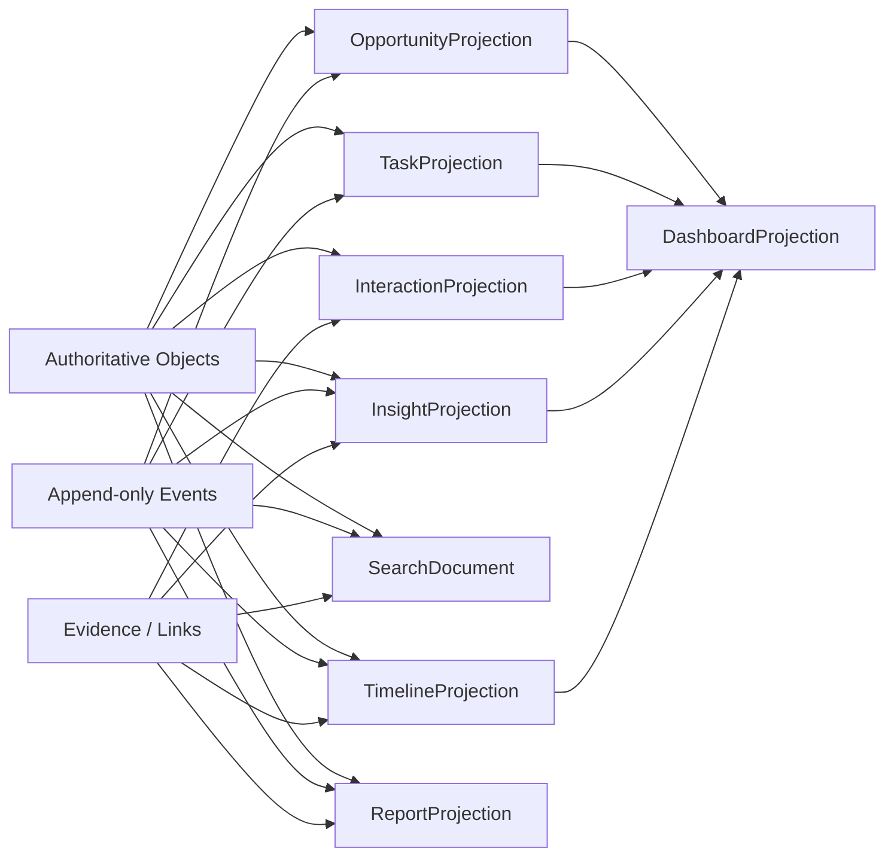

# CSIG Education Sales OS — MVP 闭环规格 V1.0

- 文档状态：Approved Domain Design / Pending Written Specification Review
- 日期：2026-07-25
- 产品定位：单用户私有化云端 Education Solution Sales Operating System
- 技术边界：Next.js、TypeScript、Tailwind CSS、Supabase PostgreSQL、Supabase Storage
- 视觉边界：全部页面复用 Design System V2.0
- 交付策略：纵向闭环交付，每个业务域独立迁移、实现、测试与 Commit

## 1. 产品目标与范围

CSIG Education Sales OS 是陪伴用户从实习学习、独立负责客户到成长为教育行业 Solution Sales 专家的长期个人工作系统。它不是传统 CRM 后台，也不是 Notion 替代品，而是由知识、客户事实、销售过程、认知资产和行动投影共同组成的个人销售操作系统。

MVP 必须完整支撑：

```text
学习
→ 知识沉淀
→ 客户与联系人管理
→ 商机创建
→ 客户互动
→ 任务承诺
→ 商机推进
→ 认知复盘
→ 知识转化
→ 日报周报
→ Dashboard 下一行动
→ Search 与 Timeline 长期回顾
```

### 1.1 MVP 模块

- Auth / RLS
- Dashboard（Today）
- Global Search
- Unified Timeline
- Knowledge Hub
- Learning
- Customer
- Contact
- Opportunity
- Interaction
- Task
- Insight
- Attachment
- Tag
- Daily Report
- Weekly Report

### 1.2 明确延期

- Account Plan
- Discovery Library
- Stakeholder Map
- Sales Playbook 高级能力
- ProfessionalFeedback
- ExpenseRecord
- AI Sales Assistant
- AI Context Snapshot
- RAG / Vector Database
- 多用户、团队协作与组织权限
- 外部 CRM、SAP 或腾讯内部系统同步

## 2. 全局架构



### 2.1 九项全局原则

1. **Fact First**：真实业务行为进入事实实体或 Append-only 事件。
2. **Projection First**：当前状态、统计和展示由权威对象与事实事件派生。
3. **Cognition Is Independent**：Insight 独立演化、验证、应用并沉淀为 Knowledge。
4. **Evidence Never Disappears**：Evidence 与历史事件永久保留。
5. **Presentation Never Owns Business State**：展示层只组合 Projection，并引导用户回到真实业务实体执行操作。
6. **Projection Rebuild Principle**：Disposable Projection 必须能够从权威数据完全重建。
7. **Projection Version Consistency**：同一请求共享统一版本、截止时间和请求上下文。
8. **Envelope Never Escapes**：TimelineEventEnvelope 仅存在于 Query Layer；稳定 `event_key` 不得改变。
9. **Search Projection Independence**：SearchDocument 只用于检索，不参与业务写入、权限判断或关系约束。

### 2.2 Projection Rebuild 的准确边界

Projection Rebuild 不代表完整 Event Sourcing。系统通过“权威业务对象当前值 + Append-only 业务事件”重建当前 Projection；过去时点展示由不可变 Snapshot、事件快照和历史字段承担。AuditLog 只用于安全与操作审计，不作为事件重放源。

系统不承诺通过事件流重建 Customer 名称、Contact 状态等主实体的全部历史字段值。

## 3. 安全基础

### 3.1 单用户私有登录

- 不提供 Sign Up、前端邀请和自助账号创建。
- 账号仅由 Supabase 后台预先创建。
- 匿名用户只允许访问 `/login` 与 `/design-system`。
- 已登录用户访问 `/login` 时跳转首页。
- 所有业务路由由受保护 Server Layout 执行 `requireUser()`。
- 所有 Server Action 与 Route Handler 独立执行 Session 校验。
- 使用 Supabase SSR Auth 和 HttpOnly Cookie。
- 不在 localStorage 保存访问令牌或业务数据。
- 登出后清理客户端查询缓存并返回 `/login`。

### 3.2 环境变量

- 浏览器只允许使用 Supabase URL 和 Anon Key。
- Service Role Key 只能存在于服务端环境。
- 普通业务 CRUD 不使用 Service Role。
- 联系方式精确检索所需 HMAC Secret 只能存在于服务端。

### 3.3 owner_id

所有业务表、关系表、事件表、审计表和持久化 Projection 必须显式包含：

```text
owner_id uuid not null
references auth.users(id)
default auth.uid()
```

规则：

- `owner_id` 不可更新。
- 表单和浏览器请求不得提供 `owner_id`。
- 所有 RLS 使用 `auth.uid() = owner_id`。
- 所有跨表关系使用 owner-aware 复合外键。
- 父表提供 `UNIQUE(owner_id, id)`。
- 子表使用 `(owner_id, parent_id) → parent(owner_id, id)`。

## 4. 通用数据约定

### 4.1 Mutable Entity

所有长期可编辑实体包含：

- `id`
- `owner_id`
- `data_level`
- `classification_reason`
- `created_at`
- `updated_at`
- `version`
- `deleted_at`
- `deleted_by`

更新采用乐观并发：

```text
WHERE id = entity_id
  AND owner_id = auth.uid()
  AND version = expected_version
```

成功后 `version + 1`；冲突返回 `409 Conflict`，不得静默覆盖。

### 4.2 Soft Delete

适用实体：

- Knowledge、Learning
- Customer、Contact
- Opportunity、Interaction、Task
- Insight、Report
- Attachment 元数据、Tag

不可 Soft Delete 或物理删除：

- OpportunityStageHistory
- TaskStatusHistory
- InsightValidationEvent
- ReportSnapshot
- ReportSourceLink
- AuditLog

普通查询默认排除 `deleted_at IS NOT NULL`，历史 Projection 必须支持 Tombstone。

### 4.3 数据分级

| 等级 | 定义 | 典型数据 |
|---|---|---|
| Level 1 | 公开学习资料 | 官方产品介绍、公开 AI 知识 |
| Level 2 | 个人工作资料 | Learning、Insight、Report |
| Level 3 | 敏感业务资料 | Customer、Contact、Opportunity、客户 Interaction |

派生数据采用来源最大等级。Level 3 不允许前端直接降级；Attachment 关联到更高等级实体后只升不自动降。

未来外部 AI 默认策略：

- Level 1：可允许。
- Level 2：经用户确认和最小化后允许。
- Level 3：禁止，必须经过受控企业模型或 AI Context 安全层。

### 4.4 请求与操作标识术语

三个标识不可混用：

- `request_id`：基础设施请求追踪标识，可空，只用于日志关联，不是业务外键。
- `client_request_id`：调用方为一次业务 Command 提供的幂等标识。
- `operation_id`：服务端为一次数据库事务或资源 Saga 分配的业务操作关联标识。

浏览器可以生成 `client_request_id`，但不能指定最终 `operation_id`。`request_id`、`client_request_id` 和 `operation_id` 均不得被关系表当作业务实体外键。

## 5. Knowledge 与 Learning

### 5.1 Knowledge

职责：保存能够持续维护和复用的知识资产，不保存具体学习过程。

核心字段：

- `title`
- `knowledge_type`
- `status`
- `confidence`
- `source_type`
- `source_name`
- `source_url`
- `summary`
- `technical_principle`
- `business_value`
- `education_scenario`
- `customer_pain_point`
- `sales_expression`
- `customer_questions`
- `competitive_note`
- `content_blocks`
- `content_schema_version`
- `content_plaintext`（服务端派生）

枚举：

- `knowledge_type`：Tencent Cloud Product、AI Technology、Education Industry、Sales Method、Solution Reference、Case Reference、General
- `status`：Draft、Learning、Ready、Archived
- `confidence`：Official、Verified、Observed、Hypothesis
- `source_type`：Official Doc、Training、Meeting、Customer、Book、Website、Internal Material、AI Generated、Personal Note

Status 表达生命周期，Confidence 表达可信程度，两者不得混用。

### 5.2 Learning

职责：记录一次真实学习、复习或实践活动。

核心字段：

- `title`
- `learning_type`
- `status`
- `objective`
- `started_at`
- `completed_at`
- `duration_minutes`
- `takeaway`
- `practice_result`
- `learning_outcome`
- `parent_learning_id`

枚举：

- `learning_type`：Study、Review、Practice、Course、Product Training、Case Analysis
- `status`：Planned、In Progress、Completed、Cancelled
- `learning_outcome`：Passed、Needs Practice、Blocked、Applied、Shared

`parent_learning_id` 形成 Study → Review → Practice 学习链。Review 必须创建新的 Learning 事实，不能覆盖原记录。

### 5.3 LearningKnowledgeLink

- 显式包含 `owner_id`。
- 通过复合外键连接 Learning 与 Knowledge。
- 保存 `mastery_before`、`mastery_after`。
- 同一 Learning 与 Knowledge 不得重复关联。

全系统固定 Mastery：

1. Aware
2. Understand
3. Explain
4. Apply
5. Teach

## 6. Customer 与 Contact

### 6.1 Customer

Customer 是机构档案，不等于商机，也不保存销售阶段、Next Action、健康度或主观规模标签。

稳定字段：

- `name`
- `normalized_name`
- `aliases`
- `customer_type`
- `education_segment`
- `region`
- `website`
- `background`
- `business_context`
- `current_technology`
- `current_cloud_provider`
- `known_needs`
- `internal_assessment`
- `student_count_estimate`
- `faculty_count_estimate`
- `campus_count`
- `organization_stats_as_of`
- `organization_stats_source`
- `record_status`：Active、Dormant、Archived
- `merged_into_id`

Customer Lifecycle、Last Interaction、Next Action 等全部由 Projection 派生。

### 6.2 CustomerExternalReference

一个 Customer 可拥有多个外部标识：

- `source_system`：Manual、SAP、Tencent CRM、Excel Import、Official Website、Other
- `external_reference`

唯一约束：

```text
UNIQUE(owner_id, source_system, external_reference)
```

### 6.3 Contact

Contact 表示某人在某个机构中的一段任职关系。

字段：

- `customer_id`
- `full_name`
- `preferred_name`
- `department`
- `position`
- `email`
- `mobile`
- `wechat`
- `preferred_channel`
- `preferred_contact_time`
- `communication_preferences`
- `employment_status`
- `relationship_status`
- `organization_influence`
- `influence_evidence`
- `previous_contact_id`

枚举：

- `preferred_contact_time`：No Preference、Morning、Afternoon、Evening
- `communication_preferences`：Email First、WeChat Preferred、Do Not Call
- `employment_status`：Active、Left、Unknown
- `relationship_status`：Unknown、New、Developing、Trusted、Dormant
- `organization_influence`：Unknown、Low、Medium、High

非 Unknown 的影响力必须提供证据。联系人转职到新机构时创建新 Contact，并使用 `previous_contact_id` 保留历史。

### 6.4 CustomerKnowledgeLink

关系类型：

- Applicable To
- Sourced From

Applicability：

- Unknown、High、Medium、Low、Not Applicable

Low 和 Not Applicable 必须填写原因。Sourced From 默认提升数据等级。

### 6.5 Merge

Customer 与 Contact Merge 使用：

```text
Preview
→ Version + Plan Hash + Preview Token
→ Confirm
→ Reparent children
→ Duplicate Tombstone
```

历史 URL 显示 Merged Into 和 Survivor，不返回无上下文的 404。

## 7. Opportunity

Opportunity 是销售过程聚合根，不是 Customer 状态。

### 7.1 Opportunity

字段：

- `customer_id`
- `parent_opportunity_id`
- `name`
- `opportunity_type`
- `source_type`
- `source_contact_id`
- `scenario`
- `customer_need`
- `desired_outcome`
- `solution_direction`
- `constraints`
- `estimated_amount`
- `currency`
- `amount_basis`
- `amount_as_of`
- `expected_decision_date`

枚举：

- `opportunity_type`：New Business、Expansion、Renewal
- `source_type`：Inbound、Outbound、Partner、Existing Customer、Marketing、Referral、Event、Internal、Other
- `currency`：ISO 4217 三位大写代码

Renewal 创建新的 Opportunity，并关联原 Closed Won Opportunity，不重置旧记录。

### 7.2 OpportunityStageHistory

阶段：

1. Lead
2. Discovery
3. Needs Confirmed
4. Solution Design
5. POC
6. Commercial Negotiation
7. Closed Won
8. Closed Lost

字段：

- `opportunity_id`
- `from_stage`
- `to_stage`
- `transition_type`
- `changed_source`
- `changed_at`
- `reason`
- `amount_snapshot`
- `expected_decision_date_snapshot`
- `operation_id`

枚举：

- `transition_type`：Initial、Forward、Backward、Skip、Reopen
- `changed_source`：Manual、Workflow、Import、Migration

StageHistory Append-only。Current Stage 只能从最新历史事件派生。Stage 不绑定概率。

### 7.3 OpportunityOutcome

字段：

- `opportunity_id`
- `outcome_type`：Won、Lost
- `final_amount`
- `currency`
- `decision_date`
- `reason`
- `competitor`
- `decision_factors`
- `customer_value`
- `lessons`
- `voided_at`
- `operation_id`

Reopen 不覆盖原 Outcome，而是保留并标记 Voided，再追加 Reopen StageHistory。

### 7.4 OpportunityContactRole

Contact 的职位、组织影响力与商机决策角色分离。同一 Contact 可以在不同 Opportunity 中承担不同角色。

MVP 使用平面角色和支持程度，不建设完整 Stakeholder Map。

## 8. Interaction 与 Task

### 8.1 Interaction

Interaction 是已经发生的销售事实；未来会议或承诺使用 Task。

字段：

- `interaction_scope`：Customer、Internal
- `interaction_type`
- `direction`
- `occurred_at`
- `recorded_at`
- `title`
- `summary`
- `outcome_summary`
- `interaction_outcome`
- `sales_impact`
- `notes_blocks`
- `notes_schema_version`
- `notes_plaintext`
- `operation_id`

枚举：

- `interaction_type`：Meeting、Call、Email、WeChat、Workshop、Presentation、Demo、POC Session、Internal Collaboration、Event、Other
- `direction`：Inbound、Outbound、Internal
- `interaction_outcome`：Positive、Neutral、Negative、Pending
- `sales_impact`：No Change、Progressed、Blocked、Follow-up Required

Customer Interaction 必须关联 Customer 和至少一个 Contact。Interaction 不自动推进 Opportunity。

### 8.2 InteractionContactLink

除真实 Contact FK 外，保存当时的参与人快照：

- `participant_name_snapshot`
- `department_snapshot`
- `position_snapshot`

Contact 后续改名、离职或 Merge 不改变历史展示。

### 8.3 InteractionOpportunityLink

一个 Interaction 可关联多个 Opportunity，但最多一个 Primary。

### 8.4 Task

Task 是未来承诺，不是已经发生的事实。

字段：

- `title`
- `description`
- `task_type`
- `priority`
- `due_at`
- `estimated_effort_minutes`
- `customer_id`
- `contact_id`
- `opportunity_id`
- `interaction_id`
- `knowledge_id`
- `learning_id`
- `completion_note`
- `sales_impact`
- `operation_id`

预设工时：15、30、60、120、240 分钟；允许为空。

### 8.5 TaskStatusHistory

Append-only 状态事件：

- Initial/Open
- Start
- Complete
- Reopen
- Cancel

Task 当前状态和 Next Action 由历史事件派生。Task 完成不自动推进 Opportunity。

### 8.6 Interaction 原子命令

创建 Interaction 时，可在同一个数据库事务内创建：

- Interaction
- Contact / Opportunity Links
- Follow-up Tasks
- Task 初始 History
- Tag Links
- Attachment Links（仅对已 Available 文件）
- SearchDocument
- AuditLog

## 9. Insight

Insight 是认知资产，回答“这说明了什么，以及何时适用”。

它不是会议记录、任务、普通笔记或稳定 Knowledge。

### 9.1 Insight

字段：

- `title`
- `insight_type`
- `insight_statement`
- `context`
- `applicable_when`
- `limitations`
- `next_experiment`
- `content_blocks`
- `content_schema_version`
- `content_plaintext`

类型：

- Sales Insight
- Customer Insight
- Technical Insight
- Industry Insight
- Workplace Insight
- Communication Insight
- Leadership Insight
- Personal Growth Insight

### 9.2 InsightEvidence

使用显式 nullable FK，并通过 CHECK 保证恰好一个来源：

- `interaction_id`
- `task_id`
- `learning_id`
- `opportunity_id`
- `opportunity_outcome_id`
- `knowledge_id`

Evidence Role：

- Origin
- Supports
- Contradicts
- Applied In
- Context

### 9.3 InsightValidationEvent

Append-only 事件：

- Proposed
- Observed
- Supported
- Contradicted
- Applied
- Validated
- Rejected
- Retired
- Reopened

Insight 当前状态由 ValidationEvent 派生为：

- Hypothesis
- Observed
- Testing
- Validated
- Rejected
- Retired

Outcome Review 是关联 OpportunityOutcome 的 Insight，不是 Outcome 上的布尔字段。Validated Insight 可以转换为 Knowledge，原 Insight、Evidence 与验证历史继续保留。

## 10. Daily / Weekly Report

Report 是人工解释与系统派生结果的展示容器，不替代底层事实。

### 10.1 Report

Daily 与 Weekly 共用 Report：

- `report_type`：Daily、Weekly
- `report_date`
- `period_start`
- `period_end`
- `timezone`
- `title`
- `focus_blocks`
- `reflection_blocks`
- `blocker_blocks`
- `learning_reflection_blocks`
- `next_plan_blocks`
- 各自对应的 schema version 与 plaintext

周期使用半开区间 `[period_start, period_end)`。

部分唯一索引：

```text
Daily:
UNIQUE(owner_id, report_type, report_date, timezone)
WHERE deleted_at IS NULL AND report_type = 'Daily'

Weekly:
UNIQUE(owner_id, report_type, period_start, period_end, timezone)
WHERE deleted_at IS NULL AND report_type = 'Weekly'
```

CHECK：

- Daily 必须有 `report_date`。
- Weekly 的 `report_date` 必须为空。
- Weekly 必须有 period_start、period_end。
- `period_end > period_start`。

报告中的行动必须转为真实 Task；可复用判断必须转为 Insight。

### 10.2 ReportSnapshot

不可变字段：

- `report_id`
- `generated_at`
- `generated_by`
- `generation_source`
- `projection_schema_version`
- `period_start`
- `period_end`
- `as_of`
- `metrics`
- `section_summary`
- `operation_id`

Snapshot 保存数量、分组、派生标签、排序和来源定位，不复制完整业务正文。

### 10.3 ReportSourceLink

显式包含 `owner_id`，并通过真实 FK 指向恰好一个来源：

- Interaction
- Task / TaskStatusHistory
- Opportunity / StageHistory / Outcome
- Learning
- Knowledge
- Insight / InsightValidationEvent
- Daily Report（供 Weekly Report 参考）

ReportSnapshot 与 ReportSourceLink 均：

- 只允许服务端 INSERT。
- Owner 可 SELECT。
- 禁止 UPDATE。
- 禁止 DELETE。
- Report Soft Delete 不影响历史 Snapshot 和 Source Link。

### 10.4 Snapshot事务

单个数据库事务、统一 `as_of` 与一致读取快照中完成：

1. 校验 Report Owner 和 Version。
2. 确定周期、时区与 `as_of`。
3. 使用 `period_start <= event_time < min(period_end, as_of)` 读取周期事实。
4. 去重和聚合。
5. 创建 ReportSnapshot。
6. 创建 ReportSourceLink。
7. 写 AuditLog。
8. 返回最新 ReportProjection。

## 11. Dashboard

首页为 **Adaptive Sales Command Center**，是 Action Orchestrator，不是 Dashboard Domain。

### 11.1 DashboardRequestContext

同一请求共享：

- `viewer_id`
- `timezone`
- `today_start`
- `today_end`
- `as_of`
- `projection_schema_version`

Today Brief、Today Focus、Timeline Preview、Growth Evidence 与 Weekly Reflection 不得自行计算 Today 或使用不同 Projection 版本。

### 11.2 Today Brief

MVP 使用可解释规则，不调用 AI。优先级：

1. 逾期高优先级 Task
2. Follow-up Required 但没有 Task 的 Interaction
3. Stalled 且没有 Next Task 的 Opportunity
4. 今日到期的重要 Task
5. 即将到期的客户承诺
6. 长时间未继续的 Learning
7. 等待验证的 Insight

每条 Brief 必须可追溯来源。

### 11.3 Today Focus

最多四个行动，来源为 Task、Interaction Gap、Opportunity Gap、Learning 与 Insight Validation。

确定性排序：

```text
紧急程度
→ 类别多样性
→ due_at
→ Task priority
→ source_updated_at
→ source_id
```

不以商机金额自动判断重要性。

### 11.4 Sales Journey

展示 Evidence Level、Evidence Progress 与 Next Practice，不展示虚构能力百分比。Mastery 继续使用 Aware → Teach 五级标准。

### 11.5 Widget Stateless

Dashboard Widget 不保存：

- Collapsed
- Completed
- Read
- Snoozed

真正需要未来处理时创建 Task；界面偏好未来归 Workspace Settings。

## 12. Global Search

### 12.1 SearchDocument

SearchDocument 是唯一全文检索来源，也是可完全重建的 Disposable Projection。

字段：

- `owner_id`
- `source_type`
- `source_id`
- `title`
- `subtitle`
- `search_text`
- `search_vector`
- `exact_lookup_hashes`
- `route`
- `data_level`
- `visibility_state`
- `source_created_at`
- `source_updated_at`
- `projection_schema_version`
- `indexed_at`
- `metadata`

唯一约束：

```text
UNIQUE(owner_id, source_type, source_id)
```

`source_type + source_id` 只允许用于 Disposable Projection，不能推广到业务 Link 或 Evidence。

### 12.2 中英文检索

组合使用：

1. 标题精确匹配
2. 标题前缀匹配
3. `pg_trgm`
4. 英文 `simple` FTS
5. 归一化 `ILIKE` 兜底

MVP 不实现拼音、同义词、中文分词服务或向量搜索。

### 12.3 联系方式查找

手机号与邮箱不进入普通全文。服务端规范化后使用 HMAC Secret 计算 `exact_lookup_hashes`，结果摘要脱敏展示；原始搜索词不进入 AuditLog、URL 或 localStorage。

### 12.4 独立性

SearchDocument：

- 不能作为 Customer Lookup 唯一来源。
- 不能参与关系约束。
- 不能决定权限。
- 不能被浏览器直接写入。
- 可以物理删除并从权威实体重建。

正常业务写入时，受影响的 SearchDocument 必须与来源实体在同一个数据库事务中更新；索引更新失败则业务写入回滚。批量版本升级时允许使用独立重建命令整体删除并重建 Projection。

## 13. Unified Timeline

Timeline 是 Event Projection，不创建 Timeline Table。

### 13.1 来源

- Interaction
- TaskStatusHistory
- OpportunityStageHistory
- OpportunityOutcome
- Learning
- Knowledge Captured
- InsightValidationEvent
- ReportSnapshot
- Attachment Added

登录、搜索、页面浏览和普通字段修改不进入 Timeline。

### 13.2 TimelineEventEnvelope

只存在于 Query Layer：

- `event_key`
- `event_type`
- `event_time`
- `recorded_at`
- `source_type`
- `source_id`
- `title`
- `summary`
- 关联实体 ID
- `operation_id`
- `data_level`
- `route`
- `display_category`
- `display_status`
- `is_backfilled`
- `projection_schema_version`

`event_key` 在事件不变时永久稳定。

### 13.3 时间与分页

- Timeline 按业务 `event_time` 排序。
- `recorded_at` 表示系统录入时间。
- 补录记录标记 Backfilled。
- 排序键：`event_time DESC, recorded_at DESC, event_key DESC`。
- 使用 Keyset Cursor，不使用 Offset。
- Cursor 绑定 projection version、as_of 和 filter hash。

### 13.4 分组

同一 `operation_id` 及同一业务关系产生的事件可组合为 Event Group，但不改变或删除来源事件。Interaction 与原子创建的 Task 在创建时折叠；Task 后续完成作为独立事件。

AuditLog 回答“系统执行了什么”，Timeline 回答“业务发生了什么”。

## 14. Attachment

### 14.1 Attachment

字段：

- `owner_id`
- `original_filename`
- `safe_filename`
- `bucket_name`
- `object_path`
- `mime_type`
- `file_extension`
- `size_bytes`
- `checksum_sha256`
- `file_category`
- `storage_status`
- `data_level`
- `uploaded_at`
- `storage_deleted_at`
- 通用版本与 Tombstone 字段

Storage Status：

- Pending
- Available
- UploadFailed
- DeletePending
- DeleteFailed
- Deleted

### 14.2 AttachmentLink

显式包含 `owner_id`，并使用 owner-aware 复合外键：

```text
(owner_id, attachment_id)
→ Attachment(owner_id, id)

(owner_id, knowledge_id)
→ Knowledge(owner_id, id)
```

其他实体同理。通过 CHECK 保证每条 Link 恰好关联一个业务实体。

### 14.3 两阶段上传 Saga

阶段一，数据库准备事务：

1. 创建 Pending Attachment。
2. 服务端确定 object_path。
3. 返回短时上传凭证。

阶段二，文件上传后执行 Finalize 数据库事务：

1. 锁定 Pending Attachment。
2. 校验 Owner、路径、大小、扩展名、Checksum 和服务端识别类型。
3. 校验 Storage 对象存在。
4. 更新为 Available。
5. 创建 AttachmentLink。
6. 写 AuditLog。

Finalize 失败时保持 Pending 或 UploadFailed，Storage 对象进入清理流程，不产生业务 Link。

### 14.4 删除 Saga

```text
Available
→ 在数据库事务中设置 deleted_at 与 DeletePending
→ 删除 Storage 对象
→ 确认对象不存在
→ Deleted
```

失败：

```text
DeletePending
→ DeleteFailed
```

只有确认对象不存在后才能设置 `storage_deleted_at`。`deleted_at` 是元数据业务 Tombstone，`storage_deleted_at` 是物理删除完成时间。

进入 DeletePending 后，普通业务查询立即隐藏该 Attachment。DeleteFailed 保留 `deleted_at`，允许安全重试删除；只有 Storage 对象仍存在时才允许撤销删除请求。进入 Deleted 后只能恢复元数据历史，不能声称文件已经恢复。

### 14.5 文件策略

- 私有 Bucket。
- 路径：`{owner_id}/{attachment_id}/{safe_filename}`。
- 默认上限 20 MiB，Bucket 硬上限 100 MiB。
- 下载 Signed URL 默认 60 秒，最大 5 分钟。
- 默认允许 PDF、DOCX、XLSX、PPTX、PNG、JPEG、WebP、TXT、Markdown、CSV。
- 默认拒绝可执行文件、脚本、主动 HTML、主动 SVG、宏启用 Office 文件和双扩展名伪装。
- Office 文件强制下载，不直接执行。
- Level 3 访问、导出和删除写 AuditLog。

## 15. Tag

Tag 用于组织和发现，不承担业务状态、权限或流程。

### 15.1 Tag

- `owner_id`
- `name`
- `normalized_name`
- `description`
- `data_level`
- 通用版本与 Tombstone 字段

部分唯一索引：

```text
UNIQUE(owner_id, normalized_name)
WHERE deleted_at IS NULL
```

MVP 不实现 Tag 颜色、层级、规则引擎、AI 自动 Tag 或同义词。

### 15.2 TagLink

显式包含 `owner_id`，使用真实 owner-aware 复合外键，并通过 CHECK 保证恰好一个实体 FK。

每种实体关系建立部分唯一索引，例如：

```text
UNIQUE(owner_id, tag_id, knowledge_id)
WHERE knowledge_id IS NOT NULL
```

AttachmentLink 同样为每种关联建立对应的部分唯一索引。

## 16. ContentBlockDocument V1

所有正文类字段共享协议、校验和渲染能力，但不强制使用相同数据库列名。

示例：

- `Knowledge.content_blocks`
- `Interaction.notes_blocks`
- `Insight.content_blocks`
- `Report.focus_blocks`
- `Report.reflection_blocks`
- `Report.blocker_blocks`

Report 的每个 `*_blocks` 都是独立 ContentBlockDocument。

服务端共享：

- Schema Validator
- Plaintext Extractor
- Attachment Reference Validator
- Safe Renderer
- Schema Migration Runner

V1 预留 Paragraph、Heading、List、Quote、Callout、Checklist、Code、Attachment Reference、Image Reference。MVP 可使用 Textarea 或轻量 Markdown 编辑，但必须写入统一 Block Envelope。

禁止任意可执行 HTML。Plaintext 由服务端派生，浏览器不能直接指定。

## 17. CommandReceipt、幂等与关联

### 17.1 CommandReceipt

字段：

- `id`
- `owner_id`
- `client_request_id`
- `command_type`
- `operation_id`
- `result_entity_type`
- `result_entity_id`
- `result_reference`
- `status`
- `started_at`
- `completed_at`
- `created_at`

唯一约束：

```text
UNIQUE(owner_id, command_type, client_request_id)
```

Status：

- Processing
- Completed
- Failed

限制：

- `result_reference` 只保存轻量结果定位，不保存业务正文。
- CommandReceipt 不是业务事件，不进入 Timeline。
- CommandReceipt 不作为 Projection 重放来源。
- 浏览器不能指定 `operation_id`。

### 17.2 client_request_id 与 operation_id

- `client_request_id`：一次 Server Command 的幂等标识。
- `operation_id`：关联同一事务或 Saga 产生的所有记录，可重复。
- 幂等唯一约束放在 CommandReceipt，不要求每条子记录的 operation_id 唯一。
- 同一命令创建多条 Task 时，共享 operation_id。

数据库内命令在同一事务完成 Receipt、业务写入、事件、AuditLog 和 Completed 结果。纯数据库命令失败时事务整体回滚。

涉及 Storage 的 Saga 允许跨事务保留 Processing、Pending 或 DeletePending；重试根据 Receipt 和资源当前状态恢复，不重复创建业务对象。

重试规则：

- 相同 CommandReceipt 已 Completed：返回原 `result_reference`。
- 纯数据库命令仍在执行：等待唯一键竞争结果或返回可重试的处理中响应，不并发执行第二次。
- 纯数据库命令事务失败：Receipt 随事务回滚，调用方可安全重试。
- 资源 Saga 仍为 Processing：使用原 `operation_id` 从当前资源状态恢复。
- 资源 Saga 已 Failed：只有同一幂等命令可以进入受控重试，不创建第二个业务对象。

`operation_id` 在首次创建 Receipt 时由服务端生成，并在所有重试中保持稳定。

## 18. AuditLog

业务 AuditLog 只记录成功登录、登出和已鉴权业务行为：

- `owner_id = authenticated user id`
- `actor_id = authenticated user id`

失败登录和匿名安全事件进入 Supabase Auth 或平台安全日志，不进入普通业务 AuditLog，因此 `owner_id` 保持 NOT NULL。

字段：

- `owner_id`
- `actor_id`
- `action`
- `entity_type`
- `entity_id`
- `request_id`
- `client_request_id`（可空）
- `operation_id`（可空）
- `occurred_at`
- `changed_fields`
- `metadata`
- `request_ip_hash`
- `user_agent`
- `result`
- `error_code`

AuditLog：

- 只允许受控服务端函数或 Trigger INSERT。
- Owner 可 SELECT。
- 禁止 UPDATE、DELETE。
- 不保存密码、Token、完整正文、完整联系方式、原始搜索词或附件内容。

必须审计：

- 成功登录、登出
- 数据创建、修改、Soft Delete、Restore
- Merge
- Stage / Task / Insight 状态事件
- Report Snapshot 与导出
- Level 3 Attachment 访问和删除
- 数据导出
- 数据等级降级
- Projection 批量重建

## 19. 数据库约束矩阵

| 对象类别 | owner_id | Mutable | Soft Delete | Version | Append-only | 可重建 |
|---|---:|---:|---:|---:|---:|---:|
| Business Object | 必须 | 是 | 是 | 是 | 否 | 否 |
| Business Process Root | 必须 | 是 | 是 | 是 | 否 | 否 |
| Business Event / History | 必须 | 否 | 否 | 否 | 是 | 否 |
| Evidence Link | 必须 | 受控 | 通常否 | 否 | 保留历史 | 否 |
| Ordinary Link | 必须 | 受控 | 可解除并审计 | 否 | 否 | 否 |
| ReportSnapshot / SourceLink | 必须 | 否 | 否 | 否 | 是 | 否 |
| SearchDocument | 必须 | 服务端重建 | 否 | 否 | 否 | 是 |
| Dynamic Projection | 请求上下文 | 否 | 否 | 否 | 否 | 是 |
| AuditLog | 必须 | 否 | 否 | 否 | 是 | 否 |
| CommandReceipt | 必须 | 受控状态机 | 否 | 否 | 否 | 否 |

关键约束：

- 所有 Link 显式包含 `owner_id`。
- 所有 nullable 多目标 Link 使用 exactly-one CHECK。
- 所有关联通过 owner-aware 复合 FK 阻止跨用户关系。
- Soft Delete 唯一性使用部分唯一索引。
- Append-only 表禁止 UPDATE 和 DELETE。
- Projection 不作为业务 FK 目标。

## 20. RLS 矩阵

| 对象 | SELECT | INSERT | UPDATE | DELETE |
|---|---|---|---|---|
| Mutable Entity | Owner | Owner/Server，owner自动写入 | Owner + Version | 禁止物理删除 |
| Ordinary Link | Owner | 受控服务端且同Owner | 通常禁止 | 受控解除并审计 |
| Append-only Event | Owner | Server Command | 禁止 | 禁止 |
| ReportSnapshot | Owner | Server | 禁止 | 禁止 |
| ReportSourceLink | Owner | Server | 禁止 | 禁止 |
| SearchDocument | Owner | Server/Rebuild | Server/Rebuild | Rebuild允许 |
| AuditLog | Owner | Trigger/受控函数 | 禁止 | 禁止 |
| CommandReceipt | Owner | Server | Server状态机 | 禁止 |

所有 Timeline UNION 分支必须在源表层执行 RLS，不能只依赖最外层过滤。

## 21. Command 与事务清单

| Command | 事务范围 | 关键输出 |
|---|---|---|
| Create / Update Knowledge | Receipt、Knowledge、Blocks、Links、Search、Audit | Knowledge |
| Create / Complete Learning | Receipt、Learning、KnowledgeLink、Search、Audit | Learning |
| Create Customer / Contact | Receipt、实体、ExternalRef、Search、Audit | Customer / Contact |
| Merge Customer / Contact | Preview校验、Receipt、重挂关系、Tombstone、Search、Audit | Survivor |
| Create Opportunity | Receipt、Opportunity、Initial StageHistory、Search、Audit | Opportunity |
| Transition Opportunity | Receipt、Version校验、StageHistory、Outcome、Audit | Stage Event |
| Create Interaction | Receipt、Interaction、Links、Tasks、TaskHistory、Search、Audit | Interaction |
| Transition Task | Receipt、Version校验、TaskStatusHistory、Audit | Task Event |
| Create / Validate Insight | Receipt、Insight、Evidence、ValidationEvent、Search、Audit | Insight |
| Convert Insight to Knowledge | Receipt、Knowledge、Link、Validation、Search、Audit | Knowledge |
| Generate Report Snapshot | Receipt、统一as_of、Snapshot、SourceLinks、Audit | Snapshot |
| Prepare Attachment Upload | Receipt、Pending Attachment | Upload Credential |
| Finalize Attachment | Receipt、锁定Pending、校验Storage、Available、Link、Audit | Attachment |
| Delete Attachment | Saga：DeletePending、Storage删除、Deleted/DeleteFailed、Audit | Tombstone |
| Restore Entity | Receipt、Version、Restore、Search、Audit | Restored Entity |

## 22. Projection 依赖图



Disposable Projection：

- SearchDocument：删除后重新抽取。
- TimelineProjection：动态 UNION。
- DashboardProjection：动态组合 Domain Projection。
- ReportProjection：从事实、事件和不可变 Snapshot 计算。
- Opportunity、Task、Interaction、Insight Projection：从权威对象和事件计算。

ReportSnapshot、ReportSourceLink、AuditLog 和 History 不是 Disposable Projection。

## 23. 页面与路由

匿名：

- `/login`
- `/design-system`

受保护：

- `/`
- `/knowledge`
- `/knowledge/[id]`
- `/learning`
- `/learning/[id]`
- `/customers`
- `/customers/[id]`
- `/contacts`
- `/contacts/[id]`
- `/opportunities`
- `/opportunities/[id]`
- `/interactions`
- `/interactions/[id]`
- `/tasks`
- `/tasks/[id]`
- `/insights`
- `/insights/[id]`
- `/reports`
- `/reports/daily`
- `/reports/daily/[date]`
- `/reports/weekly`
- `/reports/weekly/[year-week]`
- `/search`
- `/timeline`

详情页必须提供真实操作入口，不能成为静态档案。例如 Customer 可直接创建 Contact、Opportunity、Interaction 和 Task；Interaction 可直接生成 Task 或 Insight。

## 24. Design System 边界

所有页面复用 Design System V2.0。允许新增业务组合组件；如果缺少公共基础能力，必须先扩充 Design System 文档、演示和测试。

已知需补齐的公共组件：

- Textarea
- Select
- FormField
- Checkbox
- Dialog
- Command Dialog
- Badge
- Skeleton

禁止页面自行增加颜色、字号、间距、圆角、阴影、动画、Glass Effect 或独立卡片规范。

`/design-system`：

- 无需登录。
- 显著标注 Demo / Sample Data。
- 不连接业务表或私有 Storage。
- 不展示真实客户、联系人、商机或附件。

## 25. MVP 实施顺序

1. Auth / RLS / Audit / CommandReceipt 基础
2. Knowledge & Learning
3. Customer & Contact
4. Opportunity
5. Interaction & Task
6. Insight
7. Daily & Weekly Report
8. Dashboard
9. Global Search & Unified Timeline
10. Attachment / Tag 横切收口与全链路验收

每个阶段独立 Commit，并同时完成迁移、RLS、服务端校验、页面、审计、单元测试、Playwright、响应式、可访问性和生产构建。

## 26. 端到端验收

完整业务场景：

1. 后台预创建个人账号并成功登录。
2. 创建腾讯云 AI Knowledge，添加 Tag 和私有 Attachment。
3. 创建 Learning 并关联 Knowledge。
4. 完成 Learning，将 Mastery 从 Understand 提升到 Explain。
5. 创建高校 Customer 和 Contact。
6. 创建 Opportunity，并为 Contact 分配商机角色。
7. 记录客户 Interaction，上传会议材料。
8. 同一命令创建两条 Follow-up Task。
9. 完成 Task，并显式推进 Opportunity Stage。
10. 从 Interaction 创建 Insight 和 Evidence。
11. 通过后续实践验证 Insight。
12. 将 Validated Insight 转化为 Knowledge。
13. 生成 Daily Report Snapshot，从报告计划创建下一日 Task。
14. 生成 Weekly Report 并追溯所有来源。
15. Dashboard 正确生成 Today Brief、Today Focus 和成长证据。
16. Global Search 找到 Knowledge、Customer、Contact 和 Opportunity。
17. Unified Timeline 正确分组 Interaction 与两条 Task。
18. 补录过去 Interaction，按 event_time 展示并标记 Backfilled。
19. Soft Delete 来源后，历史 Timeline 和 ReportSourceLink 仍然存在。
20. Attachment 删除后没有永久公开 URL，历史显示 Tombstone。
21. 登出后所有业务路由跳转 Login。

## 27. 安全与质量验收

### 27.1 Authentication / RLS

- 未登录无法通过直接 URL 进入业务页面。
- A 用户无法读取、修改或关联 B 用户数据。
- 修改浏览器参数不能绕过 RLS。
- 所有关系表拥有 owner-aware 复合 FK。
- Service Role Key 不出现在浏览器 Bundle。

### 27.2 Attachment

- Bucket 私有。
- 只能通过短时 Signed URL 访问。
- 修改路径不能访问其他 Owner 文件。
- 删除确认 Storage 对象不存在后才标记 Deleted。
- Design System 不引用真实业务附件。

### 27.3 Concurrency / Idempotency

- 两个窗口编辑同一记录产生 409。
- 双击 Create Customer 只创建一条。
- 重试 Create Interaction 不重复生成 Task。
- 重试 Report Snapshot 不重复生成 Snapshot。
- 同一命令子记录共享 operation_id。
- AuditLog 中的 request_id 仅用于基础设施追踪，不承担幂等或业务关联语义。

### 27.4 Audit

- 成功登录、登出、删除、导出、Merge 和敏感附件访问都有记录。
- 日志中没有 Token、密码或完整敏感正文。
- AuditLog 不可更新、不可删除。
- 匿名登录失败只进入平台认证日志。

### 27.5 每阶段 Definition of Done

- 数据库迁移与约束
- RLS 策略
- Server Action / Route Handler
- 输入校验
- 列表、创建、编辑、详情和推进操作
- AuditLog
- 单元测试
- RLS 集成测试
- Playwright 真实闭环
- 响应式与可访问性检查
- Production Build
- 独立 Commit

不接受仅建表、仅静态页面、localStorage 业务模拟、长期 Mock Repository、无 RLS 或无测试的大型一次性提交。

## 28. Security Non-Goals

MVP 明确不解决：

- Multi-user Collaboration
- Role Based Access Control
- Organization Hierarchy
- Shared Customers / Shared Knowledge
- Team Workspace
- Offline Synchronization
- 自动跨设备冲突合并
- SSO、企业 MFA 与内部身份联邦
- 完整恶意文件扫描流水线
- 外部 AI 数据治理

这些能力未来必须作为独立阶段设计，不能通过在现有 Owner 模型上临时增加字段实现。

## 29. 最终定义

CSIG Education Sales OS MVP 不是保存销售数据的后台，而是：

> 以事实为基础、以行动为驱动、以认知沉淀为长期资产，并通过安全可重建的 Projection 形成个人工作视图的 Education Solution Sales Operating System。
